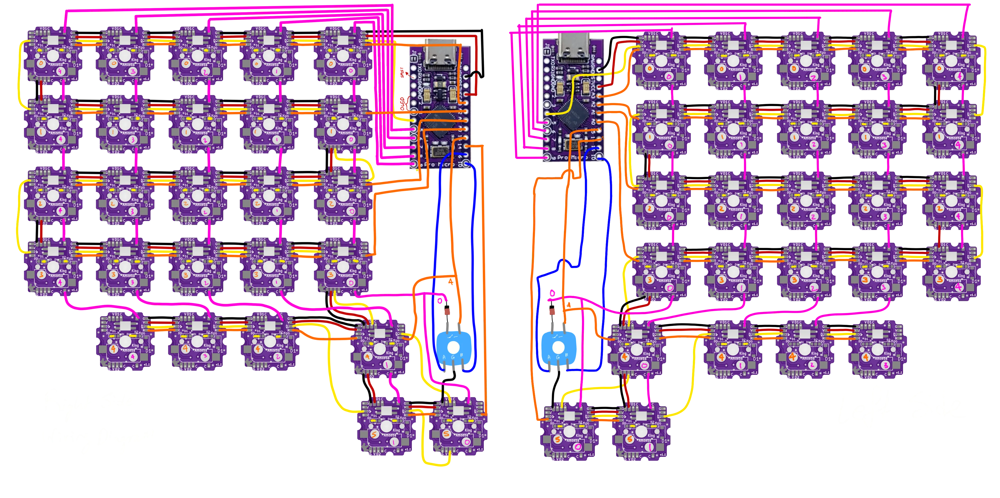
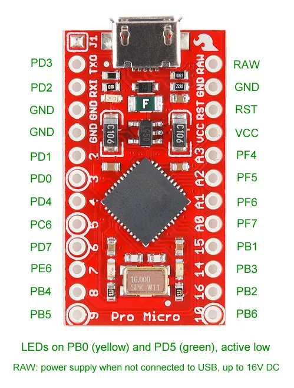

# 5 x 5 Split Keyboard w/ 5 key thumb cluster
Case generated using [Cosmos Keyboard Configurator](https://ryanis.cool/cosmos/beta#cf:ChYIBRAFWAYYACADKNcBMM0BUABAAEgAMhAIBRABOAAYACAAKMwBMMgBQlMIBOABAXgD2AEBEAFIAEgASABIAEgASABIAGAAaABwARgAIAAoAJgB9AOoAegHoAHIAbABAJABhAe4AQCAAQAwADgoWAGIAQHAAQDIAdgE0AGEBw==)

# References

## Wiring

## Pro Micro

